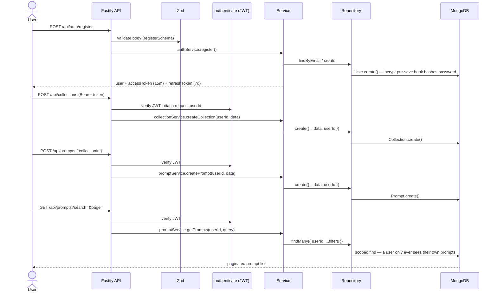

<div align="center">

# Prompt Manager

**A backend architecture reference project — the layering, auth flow, and repository pattern I reuse everywhere else.**

[](https://github.com/devinder-dev/ai-prompt-manager/actions/workflows/ci.yml)
[](https://bun.sh)
[](https://fastify.dev)
[](https://www.typescriptlang.org/)
[](https://www.mongodb.com/)
[](https://react.dev)
[](https://tanstack.com/query)
[](LICENSE)

</div>

---

A full-stack app for organizing AI prompts into collections — nothing exotic on
the product side, which is the point. It's the project where the layering I
now default to (routes → controllers → services → repositories → models) got
built out end to end: JWT auth with access/refresh tokens, Zod validation at
the edge, ownership checks on every query, and a React 19 + TanStack Query
frontend talking to it. Other projects (like [Fakturly](https://github.com/devinder-dev/fakturly))
build on top of this foundation rather than repeating it.

## How it works

The flow below is what's actually implemented — register, create a
collection, add a prompt to it, then list prompts scoped to the logged-in
user only.



**Every read and write is scoped to `userId` at the repository layer** —
`findOne({ _id, userId })`, not `findById(id)` — so there's no route that can
leak another user's data by accident.

## Status

| Component | State |
|---|---|
| Layered backend — routes → controllers → services → repositories → models | ✅ |
| JWT auth — register / login / refresh, bcrypt-hashed passwords | ✅ |
| Zod validation on every mutating route | ✅ |
| Prompts — CRUD, search, tag/favorite filters, pagination | ✅ |
| Collections — CRUD, linked prompts, unlink-on-delete | ✅ |
| Ownership checks on every query (`userId` scoped) | ✅ |
| Security — Helmet, CORS allowlist, rate limiting (100 req / 15 min) | ✅ |
| Admin seed script + role field (`user` / `admin`) | ✅ |
| React 19 frontend — routing, auth guard, Axios token interceptor | ✅ |
| TanStack Query — server state, cache invalidation on mutations | ✅ |
| CI: typecheck on every push | ✅ |
| Docker + Render Blueprint deploy | ✅ |

## Quick start

Requires [Bun](https://bun.sh) and a MongoDB instance (local or [Atlas](https://www.mongodb.com/atlas)).

```bash
git clone https://github.com/devinder-dev/ai-prompt-manager.git
cd ai-prompt-manager

cd backend
cp .env.example .env    # fill in DATABASE_URL, JWT secrets
bun install
bun dev                 # http://localhost:3000

# in a second terminal
cd ../frontend
npm install
npm run dev              # http://localhost:5173
```

```bash
curl localhost:3000/health
# {"status":"ok","timestamp":"...","environment":"development"}
```

<details>
<summary><b>API reference</b> (click)</summary>

| Method | Endpoint | Description | Auth |
|---|---|---|---|
| POST | `/api/auth/register` | Register a new user | No |
| POST | `/api/auth/login` | Login | No |
| POST | `/api/auth/refresh` | Refresh access token | No |
| GET | `/api/auth/profile` | Get current user profile | Yes |
| GET | `/api/prompts` | List prompts (search, tags, favorite, pagination) | Yes |
| POST | `/api/prompts` | Create a prompt | Yes |
| GET | `/api/prompts/:id` | Get a single prompt | Yes |
| PATCH | `/api/prompts/:id` | Update a prompt | Yes |
| DELETE | `/api/prompts/:id` | Delete a prompt | Yes |
| GET | `/api/collections` | List collections | Yes |
| POST | `/api/collections` | Create a collection | Yes |
| GET | `/api/collections/:id` | Get a collection with its prompts | Yes |
| PATCH | `/api/collections/:id` | Update a collection | Yes |
| DELETE | `/api/collections/:id` | Delete a collection (unlinks its prompts) | Yes |
| GET | `/health` | Health check | No |

</details>

<details>
<summary><b>Architecture & repository layout</b> (click)</summary>

Each layer only talks to the one directly below it:

```
route → controller → service → repository → Mongoose model
```

- **Routes** — URL + method + auth hook (`fastify.authenticate`), nothing else.
- **Controllers** — parse/validate the request (`validate(schema, body)`), call one service method, shape the response.
- **Services** — business rules (ownership checks, filter building, cross-model updates like unlinking prompts on collection delete). No knowledge of `request`/`reply`.
- **Repositories** — the only layer that talks to Mongoose. Every prompt/collection query is filtered by `userId`.

```
backend/
└── src/
    ├── config/        env validation, MongoDB connection
    ├── plugins/        security (helmet/cors/rate-limit), authenticate, error handler
    ├── schemas/        Zod schemas per resource
    ├── routes/          URL + auth wiring
    ├── controllers/     validate → call service → respond
    ├── services/        business logic, no HTTP knowledge
    ├── repositories/    Mongoose queries, always userId-scoped
    ├── models/           Mongoose schemas (User, Prompt, Collection)
    ├── types/            shared TypeScript interfaces
    └── scripts/          seed-admin.ts
frontend/
└── src/
    ├── lib/              axios instance (token interceptor, 401 handling), auth helpers
    ├── hooks/            TanStack Query hooks per resource (usePrompts, useCollections, useAuth)
    ├── pages/             route-level components
    └── components/        Layout, Navbar, Sidebar
```

**Auth details:** access tokens expire in 15 minutes, refresh tokens in 7
days, both signed with `jsonwebtoken` and verified with a pinned `HS256`
algorithm. Passwords are hashed with `bcryptjs` in a Mongoose `pre('save')`
hook, and the schema marks the field `select: false` so it's never returned
by a query unless explicitly requested. A central `errorHandler` plugin
turns `AppError`, Mongoose duplicate-key (`E11000`), Mongoose validation, and
Fastify schema-validation errors into one consistent JSON error shape.

**Frontend details:** an Axios interceptor attaches the bearer token to every
request and clears local storage + redirects to `/login` on a 401 — but only
when the user isn't already on `/login` or `/register`, so failed login
attempts don't bounce the user mid-form. TanStack Query owns all server
state; every mutation hook invalidates the relevant query key on success
instead of manually patching the cache.

</details>

<details>
<summary><b>Tech stack</b> (click)</summary>

**Backend**
- [Bun](https://bun.sh/) — runtime and package manager
- [Fastify 5](https://fastify.dev/) — web framework
- [MongoDB](https://www.mongodb.com/) + [Mongoose](https://mongoosejs.com/) — database and ODM
- [Zod](https://zod.dev/) — schema validation
- `jsonwebtoken` + `bcryptjs` — auth
- `@fastify/helmet`, `@fastify/cors`, `@fastify/rate-limit` — security plugins
- Docker — containerization

**Frontend**
- [React 19](https://react.dev/) + TypeScript
- [Vite](https://vite.dev/) — build tool
- [React Router v7](https://reactrouter.com/) — client-side routing
- [TanStack Query 5](https://tanstack.com/query) — server state management
- [Axios](https://axios-http.com/) — HTTP client with interceptors

</details>

<details>
<summary><b>Deploy</b> (click)</summary>

The backend ships with a [Render Blueprint](render.yaml) for one-click deployment (Dockerfile-based).

[](https://render.com/deploy?repo=https://github.com/devinder-dev/ai-prompt-manager)

**Steps:**
1. Create a free [MongoDB Atlas](https://www.mongodb.com/atlas) cluster and copy its connection string.
2. Click **Deploy to Render** above (or push this repo and choose *New → Blueprint* in Render).
3. When prompted, set the two `sync:false` env vars:
   - `DATABASE_URL` → your Atlas connection string
   - `FRONTEND_URL` → your deployed frontend origin (for CORS)
   - `JWT_SECRET` and `JWT_REFRESH_SECRET` are generated automatically by Render.
4. After the service is live, seed an admin user by running `bun run src/scripts/seed-admin.ts` with `ADMIN_PASSWORD` set (see `.env.example`).

> Render injects `PORT` automatically; the app binds to it via `env.PORT`. Health checks hit `/health`.

</details>

---

<div align="center">

**Devinder Singh** · Fullstack Developer (YH) student at Chas Academy, Stockholm

</div>
